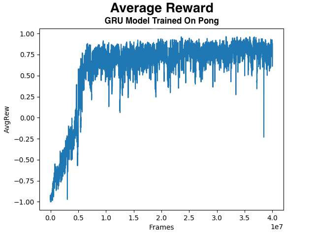
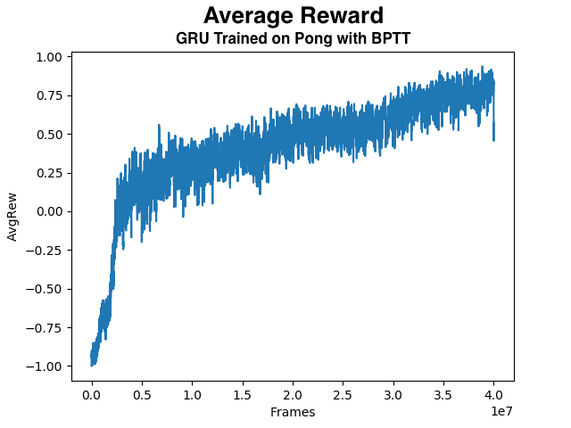

# A2C

## Description
This is an implementation of [A2C](https://blog.openai.com/baselines-acktr-a2c/) written in PyTorch using OpenAI gym environments.

This implementation includes options for a convolutional model, the original A3C model, a fully connected model (based off Karpathy's Blog), and a GRU based recurrent model. 

#### BPTT
The recurrent training can optionally use backpropagation through time (BPTT) which builds gradient dependencies over a sequence of states rather than the simply the current state. Preliminary results indicate that using BPTT does not improve training performance. See [Performance](#Performance) for a comparison of the two training approaches.

## <a name="Performance">Performance</a>
The algorithm was trained on Pong-v0. The reward graphs are of the moving average of the reward collected during rollouts for training.

For Pong, the reward metric is a running average of the reward collected at the end of each game rather than the full 21 point match. This makes the minimum reward -1 and the maximum +1. The moving average factor was set at 0.99.

------------------



Plot of the average reward during the training of a GRU model on Pong-v0 over the course of 40 million time steps.

------------------



Plot of the average reward during the training of a GRU model on Pong-v0 trained using Backprop Through Time over the course of 40 million time steps.

------------------

## How to Use this Repo
### Training
To train a model you will need to have a hyperparameters json and a hyperranges json. The hyperparameters json details the values of each of the training parameters that will be used for the training. See the [training scripts readme](training_scripts/readme.md) for parameter details. The hyperranges json contains a subset of the hyperparameter keys each coupled to a list of values that will be cycled through for training. Every combination of the hyperranges key value pairs will be scheduled for training. This allows for easy hyperparameter searches. For example, if `lr` is the only key in the hyperranges json, then trainings for each listed value of the learning rate will be queued and processed in order. If `lr` and `l2` each are in the hyperranges json, then every combination of the `lr` and `l2` values will be queued for training.

To run a training session, navigate to the `training_scripts` folder:

```
$ cd training_scripts
```

And then select the cuda device index you will want to use (in this case 0) and type the following command:

```
$ CUDA_VISIBLE_DEVICES=0 python3 main.py path_to_hyperparameters.json path_to_hyperranges.json
```
## Setup
After cloning the repo, install all necessary packages locally:
```sh
python3.6 -m pip install --user -r requirements.txt
```
Next you will to install this pip package. Run the following:
```sh
python3.6 -m pip install --user -e .
```

### Watching Your Trained Policy
After training your policy, you can watch the policy run in the environment using the `watch_model.py` script. To use this file, pass the name of the saved PyTorch Module state dict that you would like to watch. You will also like to specify the environment type and model type by setting the default `hyperparams` in `hyperparams.py` or by specifying at the command line using: `env_type=<name_of_gym_environment>` and `model_type=<model_type>` respectively.

Here's an example:

    $ python watch_model.py save_file=default_net.p env_type=Pong-v0 model_type=conv

The order of the command line arguments does not matter.

### Automated Hyper Parameter Search
Much of deep learning consists of tuning hyperparameters. It can be extremely addicting to change the hyperparameters by hand and then stare at the average reward as the algorithm trains. THIS IS A HOMERIAN SIREN! DO NOT SUCCUMB TO THE PLEASURE! It is too easy to change hyperparameters before their results are fully known. It is difficult to keep track of what you did, and the time spent toying with hyperparameters can be spent reading papers, studying something useful, or calling your Mom and telling her that you love her (you should do that right now. Your dad, too)

This repo can automate your hyperparameter searches using a `hyperranges json`. Simply specify the key you would like to search over and specify a list of values that you would like that key to take. If multiple keys are listed, then all combinations of the possible values will be searched. 
#### List of Valid Keys for hyperparams json
Set values in a json and run `$ python3 main.py hyperparams.json` to use the specified parameters.

##### String Hyperparameters
* `exp_name` - string of the name of the experiment. Determines the name that the PyTorch state dicts are saved to.
* `model_type` - Denotes the model architecture to be used in training. Options include 'fc', 'conv', 'a3c', 'gru'
* `env_type` - string of the type of environment you would like to use A2C on. The environment must be an OpenAI gym environment.
* `optim_type` - Denotes the type of optimizer to be used in training. Options: rmsprop, adam

##### Integer Hyperparameters
* `max_tsteps` - Maximum number of time steps to collect over course of training
* `n_tsteps` - integer number of steps to perform in each environment per rollout.
* `n_envs` - integer number of parallel processes to instantiate and use for training.
* `n_frame_stack` - integer number denoting number of observations to stack to be used as the environment state.
* `n_rollouts` - integer number of rollouts to collect per gradient descent update. Whereas `n_envs` specifies the number of parallel processes, `n_rollouts` indicates how many rollouts should be performed in total amongst these processes. 
* `n_past_rews` - number of past epochs to keep statistics from. Only affects logging and statistics printing, no effect on actual training.

##### Float Hyperparameters
* `lr` - learning rate
* `lr_low` - if `decay_lr` is set to true, this value denotes the lower limit of the `lr` decay.
* `lambda_` - float value of the generalized advantage estimation moving average factor. Only applies if using GAE.
* `gamma` - float value of the discount factor used to discount the rewards and advantages.
* `gamma_high` - if `incr_gamma` is set to true, this value denotes the upper limit of the `gamma` increase.
* `val_coef` - float value determining weight of the value loss in the total loss calculation
* `entr_coef` - float value determining weight of the entropy in the total loss calculation
* `entr_coef_low` - if `decay_entr` is set to true, this value denotes the lower limit of the `entr_coef` coeficient decay.
* `max_norm` - denotes the maximum gradient norm for gradient norm clipping

##### Boolean Hyperparameters
* `resume` - boolean denoting whether the training should be resumed from a previous point.
* `render` - boolean denoting whether the gym environment should be rendered
* `decay_lr` - if set to true, `lr` is linearly decreased from `lr`'s initial value to the lower limit set by `lr_low` over the course of the entire run.
* `decay_entr` - if set to true, `entr_coef` is linearly decreased from `entr_coef`'s initial value to the lower limit set by `entr_coef_low` over the course of the entire run.
* `use_nstep_rets` - if set to true, uses [n-step returns](https://arxiv.org/abs/1705.07445) method for value loss as opposed to empirical discounted rewards.
* `norm_advs` - if set to true, normalizes advantages over entire dataset. Takes precedence over `norm_batch_advs`.
* `use_bnorm` - uses batch normalization in model if set to true
* `use_bptt` - uses backprop through time if using recurrent model and set to true

##### Specific to snake-v0
* `grid_size` - integer denoting square dimensions for size of grid for snake.
* `n_foods` - integer denoting number of food pieces to appear on grid
* `unit_size` - integer denoting number of pixels per unit in grid.

